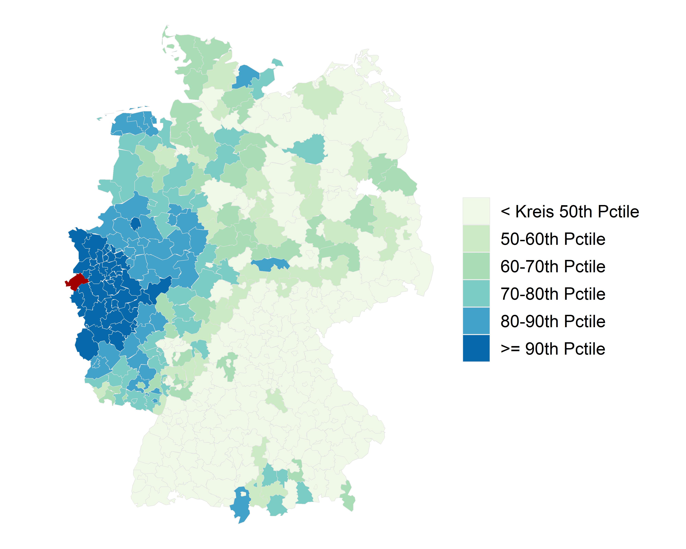

  

 

Hi, I'm Victor, **data scientist** at the **Think tank** [Institute for Security Policy at Kiel University](https://www.ispk.uni-kiel.de/en) (ISPK) for the projects [ERAME](/images/erame/erame_english_description.pdf) & [ERAME-Rex](/images/rex/english_description_rex.pdf), which are **funded by Germany's** [Federal Ministry of Education and Research](https://www.bmbf.de/bmbf/en/home/home_node.html) **(BMBF)** to develop software solutions that use **machine learning**, [text-as-data](https://en.wikipedia.org/wiki/Text_mining) and [Natural Language Processing](https://en.wikipedia.org/wiki/Natural_language_processing) **(NLP)** to identify a) **islamic** and b) **extreme-right radicalization** on **social media**.
<iframe src="../images/erame/lda-mallet-10.html" height="210" width="950" name = "iframe_a" title="Iframe Example"></iframe>
**Previously**, I worked as **research associate** (and taught courses **in both German and English**) at both the political science and the sociology departments at the [Christian-Albrechts-Universität zu Kiel](https://www.uni-kiel.de/en/) in **Germany** (from where I obtained my **PhD in 2018**) and at some of the **largest** [Think tanks](https://en.wikipedia.org/wiki/Think_tank) in the **US and Europe** ([Wilson Center](https://www.wilsoncenter.org/), [Center for International Policy](https://internationalpolicy.org/) & [Centre for European Policy Studies](https://www.ceps.eu/)).

I have both **substantial and methodological** peer-reviewed publications in [*State Politics & Policy Quarterly*](https://www.cambridge.org/core/journals/state-politics-and-policy-quarterly), [*State and Local Government Review*](https://journals.sagepub.com/home/SLG) and [*Nomos Publishing*](https://www.nomos.de/en/) (see section [publications](https://victor-cruz-aceves.github.io//portfolio/) or my profile on [ResearchGate](https://www.researchgate.net/profile/Victor-Cruz-Aceves-2/research)).

By clicking on the following links, you will find my [appearances on TV](https://victor-cruz-aceves.github.io//talks/) and a short version of my [CV](https://victor-cruz-aceves.github.io//cv/), where you will also find a summary of my language, **programming** and **analytical/methods skills**.

Contact
======
If you want to contact me, please use any of the options listed [here](https://www.ispk.uni-kiel.de/en/staff/staff/dr-victor-cruz-aceves).
