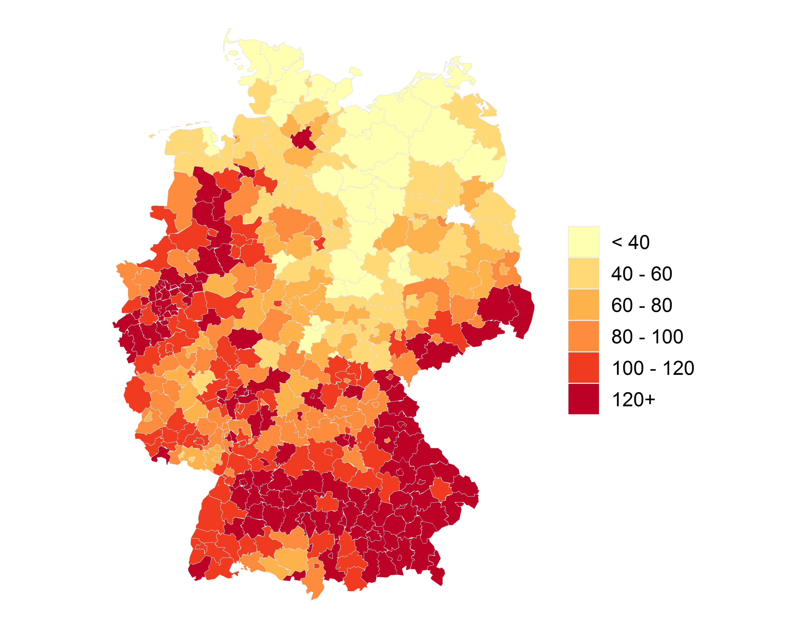
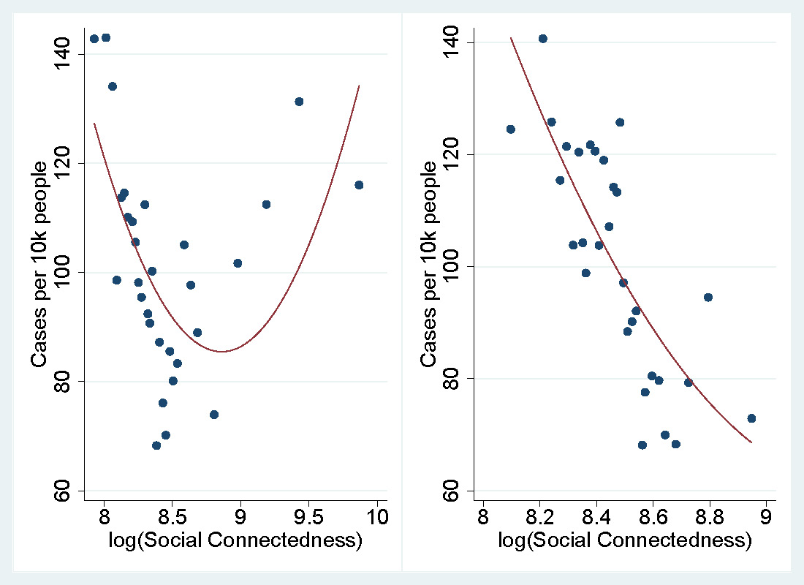



* Cruz-Aceves, Victor et. al. (2024): **ERAME & ERAME-REX – Monitoring and Machine learning-based evaluation of islamic and right-wing radicalization on social media**. Poster/software-demo at the *Monitoringsystem und Transferplattform Radikalisierung* [*(MOTRA-K) Conference*](https://www.motra.info/motra-k-2024/) in Wiesbaden, Germany

 

* Cruz-Aceves, Victor; Jost, Jannis (2022): **Automated identification of islamic radicalization in social media**. Presentation at the *Monitoringsystem und Transferplattform Radikalisierung (MOTRA-K)* Conference in Wiesbaden, Germany.
<iframe src="../images/erame/lda-mallet-10.html" height="290" width="950" name = "iframe_a" title="Iframe Example"></iframe>

* **(Book)** Cruz-Aceves, Victor (2021b): [The Diffusion of Morality Policies. State-Level Comparative Analyses in the United States of America](https://www.nomos-shop.de/nomos/titel/the-diffusion-of-morality-policies-id-100739/). Publishedd by [*Nomos Publishing*](https://www.nomos.de/en/).

 

* Cruz-Aceves, Victor (2021a): [Social-Network (Facebook) Connectedness and COVID-19 Outbreak in German Municipalities.](https://www.researchgate.net/publication/348265859_Social-Network_Facebook_Connectedness_and_COVID-19_Outbreak_in_German_Municipalities) (Working paper).

* Cruz-Aceves, Victor; Mallinson, Daniel (2019): [Clarifying the Measurement of Relative Ideology in Policy Diffusion Research](https://journals.sagepub.com/doi/10.1177/0160323X20902818). In [*State and Local Government Review*](https://journals.sagepub.com/home/SLG) 51 (3), pp. 179–186. DOI: 10.1177/0160323X20902818

* Beer, Caroline; Cruz-Aceves, Victor (2018): [Extending Rights to Marginalized Minorities. Same-Sex Relationship Recognition in Mexico and the United States](https://www.cambridge.org/core/journals/state-politics-and-policy-quarterly/article/abs/extending-rights-to-marginalized-minorities-samesex-relationship-recognition-in-mexico-and-the-united-states/A70979049B8F29EA6DA27F69D8A931C7). In [*State Politics & Policy Quarterly*](https://www.cambridge.org/core/journals/state-politics-and-policy-quarterly) 18 (1), pp. 3–26. DOI: 10.1177/1532440017751421

* Cruz-Aceves, Victor (2018): **The Diffusion of Morality Policies**. PhD/Doctoral dissertation. *Christian-Albrechts-Universität zu Kiel* (Germany). Note: [Magna Cum Laude](https://en.wikipedia.org/wiki/Latin_honors#Germany)/[1,1](https://en.wikipedia.org/wiki/Academic_grading_in_Germany#Tertiary_education) (equivalent to [~ 4 GPA in the US](https://en.wikipedia.org/wiki/Academic_grading_in_Germany#Overview))

